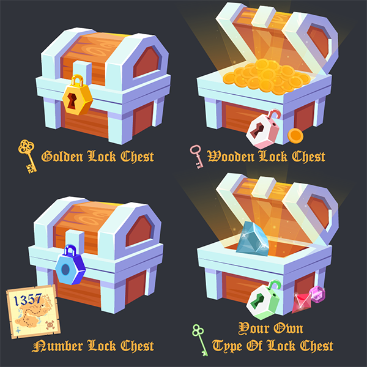
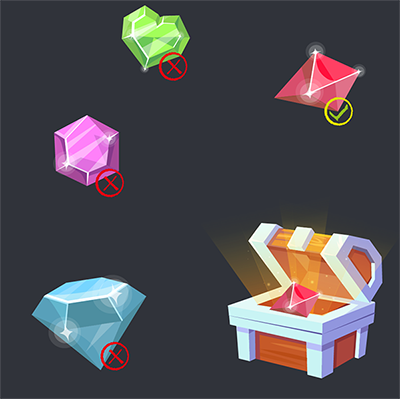
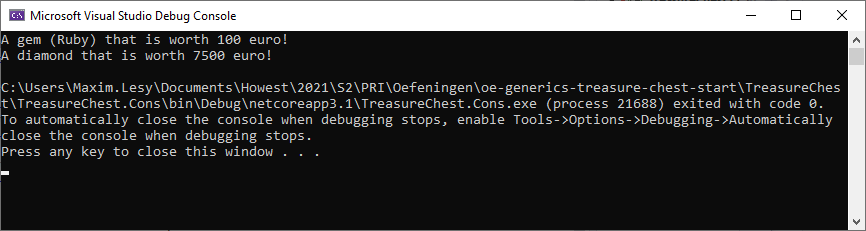
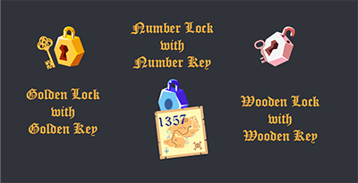
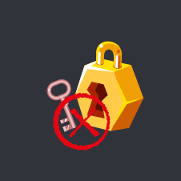
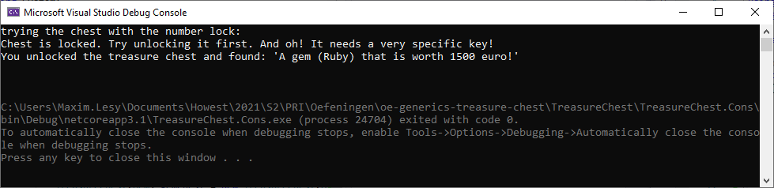

# oe-generics-treasure-chest-start

## Opzet
Ahoy, matey! In deze oefening kruip je in de huid van Captain Jack Sparrow als boy pirate of in de huid van Redd mocht je een lady pirate zijn.

Je maakt schatkisten (`TreasureChest`) met verschillende soorten sloten (`Lock`) die enkel open gaan met een correcte sleutel (`Key`).

Dit is een **deels begeleide oefening** die de mogelijkheden van generics binnen C# verkent binnen een **consoleapplicatie**. Yo Ho Ho!

## Doel
* Generics leren gebruiken
* Generic constraints leren gebruiken
* Loose coupling verkennen in een generic situatie

## Voor we van start gaan ...
Beschouw even het concept van een schatkist. Mochten we die in het echt maken, dan is elke schatkist anders. Hij heeft verschillende vormen, is gemaakt van een ander materiaal, heeft een ander soort slot, dat op zijn beurt weer een andere soort sleutel heeft, enzovoort.

Iets dergelijks programmeren is niet evident. Alle behoort namelijk toe aan zijn eigen klasse(s). Wanneer we dan een schatkist willen maken zouden we heel veel verschillende soorten klasses kunnen maken met elk zijn specifieke eigenschappen, maar dat is op lange termijn niet onderhoudbaar. Arrrghh.

Hier zijn generics interessant. In wat volgt verkennen we de mogelijkheden en leren we er de voordelen van kennen. 

We bieden in deze oefening dus een antwoord op het volgende:
*"Hoe zorg je ervoor dat we een schatkist kunnen maken die we flexibel kunnen programmeren?"*

Ter visualisatie willen we het mogelijk maken om deze schatkisten te maken in onze code (maar slechts 1 klasse ervoor nodig te hebben):



> Merk alvast op dat:
> * We steeds eenzelfde schatkist (`TreasureChest`) maken
> * De inhoud van de schatkist eender wat kan zijn. Misschien wel rum!
> * Een schatkist vergrendeld wordt met eender wel soort slot ...
> * ... die open gaat met een sleutel van hetzelfde materiaal.

**Let's ... sail away!**

## Opdracht 1 - Eender wel item in de schatkist stoppen
We starten zo eenvoudig mogelijk. We zullen beginnen met het maken van een schatkist zonder slot, maar we zorgen er wel voor dat we reeds eender welk item in de kist kunnen stoppen.


1. Maak in het `.Core` project alvast een klasse `TreasureChest` in de `Domain` map. Laat deze voorlopig nog leeg. 

2. Omdat we verschillende items in de `TreasureChest` willen kunnen stoppen, maken we alvast onmiddellijk een aantal items aan. Hier zullen we verschillende klasses onderbrengen die de inhoud van onze `TreasureChest` zullen voorstellen. Maak hiervoor in de `Domain` folder een nieuwe folder met de naam `Items`.

3. Gezien we verschillende soorten items willen aanmaken, is dit een interessante plek om een basisklasse te voorzien. Maak in de `Items` folder een `abstract class ItemBase` en zorg ervoor dat deze een property in de constructor ontvangt dat vertelt hoeveel het item waard is, uitgedrukt in euro. Elk item dat we in de schatkist stoppen heeft namelijk een geldwaarde.

4. Maak nu - ook in de `Items` folder - een aantal concrete klasses. Met andere woorden: maak nu klasses aan voor de items die we in de schatkist willen kunnen stoppen. Gebruik hiervoor deze tabel. Deze klasses erven allemaal over van `BaseItem`:

|class name|properties|extra info|
|----------|----------|----------|
|`Diamond` |`IsCut`, `Faces`| Een diamant heeft een waarde, is al dan niet geslepen in een aantal vlakken.|
|`Gem`|`Name`|Een edelsteel (gem) heeft een naam die aangeeft wel soort edelsteen het is (Robijn, saffier, smagard, opaal, ...|
|`CoinPile`|`NumberOfCoins`, `CoinType`|Een hoopje geld bestaat uit x-aantal munten. Deze munten kunnen gemaakt zijn van zilver, goud, koper, brons, ...|

> **! 🏴‍☠️** Denk goed na over access modifiers en het doorgeven van de gegevens naar de basisklasse.

> **? 🦜** *Bedenk gerust ook zelf iets wat je in de schatkist wil kunnen stoppen. Misschien wil je er wel rum in kunnen stoppen?* 😉


5. voorzien alle klasses die je maakte alvast van een `override` voor de  `ToString()`-methode. Bepaal zelf wat welke info je wil tonen over het object wanneer de inhoud van de schatkist onthuld wordt.

6. We hebben nu een aantal items aangemaakt die wie in de schatkist kunnen stoppen. Tijd dat te doen. Ga naar de `TreasureChest` klasse. Het doel is om een **type safe** schatkist te maken. We maken dus **een schatkist van een bepaald type**. Gebruik de angle brackets (`<>`) om aan te geven dat je een schatkist wil maken van *een* type.
Een (informele) conventie is om dit type `T` te noemen. De signatuur ziet er nu als volgt uit:

```csharp
    //Een schatkist van het type ...
    public class TreasureChest<T>
    {

    }
```

> **! 🏴‍☠️** Dit bekent dus dat we de inhoud niet zomaar kunnen wijzigen. We zullen namelijk vastleggen op welke manier we de schatkist kunnen gebruiken. Eenmaal definiëren dat we een schatkist willen maken met een diamant als inhoud, dan kan dit **voor dié schatkist niet meer gewijzigd worden**.
>
> Wel zal het mogelijk zijn om een **nieuwe instantie** van een schatkist te maken met een andere inhoud.
7. Tijd om de schatkist te vullen met een item. In de `Program.cs` klasse schrijf je nu in de `Main` method de code die een schatkist instantieert. Voeg nodige `using` statements en references naar het `.Core` project toe en maak een nieuwe schatkist aan dat `Gems` kan bevatten:

```csharp
        static void Main(string[] args)
        {
            TreasureChest<Gem> gemChest = new TreasureChest<Gem>();
        }
```

8. Het item zit hiermee nog niet *in* de kist. Zorg ervoor dat we via de constructor van de `TreasureChest` het item in de kist kunnen stoppen:
```csharp
        static void Main(string[] args)
        {
            //Dit moet werken ...
            Gem ruby = new Gem(100, "Ruby");
            TreasureChest<Gem> gemChest = new TreasureChest<Gem>(ruby);

            //... maar dit ook ...
            Diamond diamond = new Diamond(7500, true, 9);
            TreasureChest<Diamond> diamondChest = new TreasureChest<Diamond>(diamond);
        }
```

> **! 🏴‍☠️** In de code hierboven maken we een schatkist verschillende types aan. We definiëren wat de inhoud van de schatkist mag zijn. Gezien we - zoals eerder vermeld - type safe werken is de onderstaande code dus **niét** mogelijk. We zeggen namelijk dat het een schatkist wordt van het type `Diamond`, maar we stoppen er een `Gem` in:
> ```csharp
>        static void Main(string[] args)
>        {
>            Gem ruby = new Gem(100, "Ruby");
>            TreasureChest<Diamond> gemChest = new TreasureChest<Diamond>(ruby);
>        }
> ```
> 

9. Tijd om het mogelijk te maken om de inhoud van de schatkist te kunnen bekijken. Voorzie in de `TreasureChest` een methode `RevealContent()` die de inhoud van de schatkist toont. Denk eraan, daarnet maakten we overrides van de `ToString()` methode. Deze willen we nu gebruiken. Zorg ervoor dat we de inhoud kunnen tonen in het consolescherm:
```csharp
        static void Main(string[] args)
        {
            Gem ruby = new Gem(100, "Ruby");
            TreasureChest<Gem> gemChest = new TreasureChest<Gem>(ruby);
            string gemChestContent = gemChest.RevealContent();
            Console.WriteLine(gemChestContent);

            Diamond diamond = new Diamond(7500, true, 9);
            TreasureChest<Diamond> diamondChest = new TreasureChest<Diamond>(diamond);
            string diamondChestContent = diamondChest.RevealContent();
            Console.WriteLine(diamondChestContent);
        }
```



> **! 🏴‍☠️** Deze code hoor eigenlijk niet te verworden. Een `List` - die je ongetwijfeld kent - kan eender wat bevatten. Dat komt omdat een net ook generisch is: `List<T>`. Eigenlijk wist je dus al dat je het type naderhand niet meer kan veranderen, maar je wel eender welke soort lijst kan aanmaken. We deden net hetzelfde met de `TreasureChest`. Probeer dus maar eens `TreasureChest<string>` te maken. Ook dit is mogelijk!

10. Tot slot leggen we nog een constraint (NL: beperking) op. we willen enkel een `class` als mogelijke inhoud voor de kist. Een `struct`, bijvoorbeeld, willen we niet aanvaarden:

```csharp
public class TreasureChest<T> where T : class
```

💢🥃 _**Savvy that, pirate? Have a rum! Proficiat je begrijpt de basics over generics! Arrrr.**_

## Opdracht 2 - Sloten voorzien
*In dit deel van de oefening ga je zelfstandiger op zoek naar de oplossing. Er zal minder begeleiding worden voorzien.*

## Klasses klaarmaken
Op dit moment heeft een `TreasureChest` nog geen vereist slot. Net zoals daarnet willen we eender wel soort slot op een kist kunnen stoppen. Echter, de logica gebiedt dat wanneer je een houten slot hebt, je deze ook opent met een houten sleutel. Een cijferslot gaat dan weer open met een cijfercombinatie. Het zou behoorlijk gek zijn om een cijferslot te kunnen openen met een houten sleutel, bijvoorbeeld. We zorgen er dus voor dat diezelfde logica afgedwongen zal worden in de programmacode m.b.v. constraints.

We hebben dus een aantal nieuwe zaken nodig in het project. Voorzie in de `Domain` map twee nieuwe mappen: `Keys` en `Locks`.

Breng daarin de volgende klassen onder en laat ze voorlopig nog blanco:
|Locks|Keys|extra info|
|-----|----|----------|
|`GoldenLock`|`GoldenKey`|Een gouden sleutel hoort een gouden slot te kunnen openen|
|`WoodenLock`|`WoodenKey`|Een houten sleutel hoort een gouden slot te kunnen openen|
|`NumberLock`|`NumberKey`|Een cijfercombinatiesleutel hoort een nummerslot te kunnen openen.|

## Sleutels programmeren
Voorzie eerst nog een `abstract class KeyBase` die een property `Pins` heeft. Elke sleutel is namelijk anders en heeft geen of meerdere pinnen. Laat alle sleutel ervan overerven.

|soort sleutel|eigenschappen|extra info|
|-------------|-------------|----------|
|`GoldenKey`|`Carats`|een gouden sleutel heeft een aantal karaat.
|`WoodenKey`|`Name`|De naam bepaalt uit wel soort hout de sleutel gemaakt is|
|`NumberKey`|`Number`|Een code om het slot te kunnen openen|

Elke sleutel heeft een `override` van de `ToString()` methode om de info ervan te kunnen tonen.

## Codelogica voor sloten
*Voor dit onderdeel hoef je niets te programmeren. We verkennen de codelogica die we willen maken.*



Nu is het tijd om stil te staan bij hoe een slot werkt. We nemen het nummerslot als voorbeeld:
Een `NumberLock` gaat enkel open wanneer we de juiste cijfercombinatie kennen. Deze cijfercombinatie is (al dat niet) gekend door de `NumberKey`. Kent de `NumberKey` dus de juiste combinatie, dan gaat het `NumberLock` open. Anders niet.


> **! 🏴‍☠️** Ter info: indien we geen constraints zouden opleggen (en mits refactoren van de code) zou het wél mogelijk kunnen zijn om met eender welke sleutel een slot open te maken. Dan zou het bijvoorbeeld mogelijk zijn om een loper te maken ...

We maken de volgende logica:
|soort slot|fields|hoe openen?|voorwaarde tot openen|
|----------|------|-----------|---------------------|
|`GoldenLock`|`_minimumCaratsToOpen`|`GoldenKey`|De gouden sleutel moet minstens zoveel karaat zijn als het slot, anders gaat het slot niet open.|
|`WoodenLock`|`/`|`WoodenKey`|Geen. Dit slot gaat altijd open. Gaat te gemakkelijk stuk!|
|`NumberLock`|`_combination`|`NumberKey`|De code aangeleverd door de sleutel moet overeenkomen met die in het slot.|

## Sloten programmeren
In het vorige onderdeel legden we reeds vast wat de constraints voor de sloten zijn. We bepalen met andere woorden zelf dat het onmogelijk moet zijn om met een `WoodenKey` een `GoldenLock` open te krijgen.

**Alle** sloten moeten wel de mogelijkheid hebben om open te gaan. We maken hiervoor een interface aan. Waarom? Omdat de interfaces dan het **gedrag** kan bepalen dat elk slot **moet implementeren**.

Echter, **hoé** dat gedrag wordt geïmplementeerd is een verantwoordelijkheid van de concrete types die de interface zullen implementeren.

Maak in onder `Domain` een nieuwe map `Interfaces` en definieer het volgende:

```csharp
    public interface ILock<TKey> where TKey : KeyBase
    {
        bool TryOpen(TKey key);
    }
```

Laat alle `Locks` de interface implementeren. Hou in de `TryOpen()`-methode rekening met de vereisten om het slot te kunnen openen.

> **! 🏴‍☠️** Merk volgende zaken op:
> * We maken een generische interface maken, die hoort te werken met alles wat overerft van `KeyBase`. Het slot heeft dus een bepaald type sleutel gekoppeld (zoals eerder aangehaald) waarmee geprobeerd kan worden om de kist te openen
> * De methode `TryOpen()` gebruikt de generische sleutel
> * `<T>` noemt nu `<TKey>` om een duidelijkere naam te voorzien

## Een slot op de kist zetten
Momenteel is onze kist van het type `<T>` waarbij `<T>` de inhoud voorstelt. We breiden de code uit naar:
```csharp
public class TreasureChest<TContent, TLock, TKey> 
```
Zoals daarnet afgesproken willen we echter een aantal constraints opleggen. Schrijf de volgende aanvullende constraints:
1. `TLock` moet de `ILock` implementen om gebruikt te kunnen worden
2. `TKey` moet overerven van `KeyBase`

Ontvang in de constructor enkel het slot. Nogmaals: we legende namelijk al vast dat een slot onmiddellijk een bijhorend type sleutel dient te hebben.

```csharp
//ctor
public TreasureChest(TLock lockMechanism, TContent item)
```

Zorg ervoor dat je in de `TreasureChest` bijhoudt wel soort slot er gebruikt wordt en of de kist op slot is op niet (`bool IsLocked`). In de constructor zorg je ervoor dat de kist standaard op slot gaat.

Schrijf tot slot twee methodes in de `TreasureChest`:

|methode|doet wat?|
|-------|---------|
|`bool TryUnlock(TKey key)`|probeert de kist te openen met een sleutel. In deze methode roep je de `TryOpen()` methode op uit de eerder gedefineerde interface. Indien gelukt wordt de `IsLocked` property op `false` gezet|
|`string RevealContent()`|Onthult wat er in de kist zit, indien ze unlocked werd (`IsLocked = false`).|

## Kisten maken, en unlocken met verschillende sleutels
Bij wijze van voorbeeld hieronder een aantal voorbeelden van verschillende kisten die wel/niet werken. Test er zelf een aantal uit!

```csharp
//Here we create a treasure chest that has a number lock. We need a key with the same number to open it.
//The content of the treasure chest is now a Gem (class)!
var numberLock = new NumberLock(1234);

var goodNumberKey = new NumberKey(1234);
var badNumberKey = new NumberKey(6789);

Gem gem = new Gem(1500, "Ruby");

TreasureChest<Gem, NumberLock, NumberKey> numberedLockChest =
    new TreasureChest<Gem, NumberLock, NumberKey>(numberLock, gem);

//first we try the wrong number key
numberedLockChest.TryUnlock(badNumberKey);
string content = numberedLockChest.RevealContent();
Console.WriteLine(content);

//but it opens with the correct number
numberedLockChest.TryUnlock(goodNumberKey);
content = numberedLockChest.RevealContent();
Console.WriteLine(content);
```


> 🍾 **Blimey! If rum can’t fix your code, you are not using enough rum ...**
>
>**Congrats, pirate! Je maakt een generische schatkist! Set sail for the next wild experience!**
